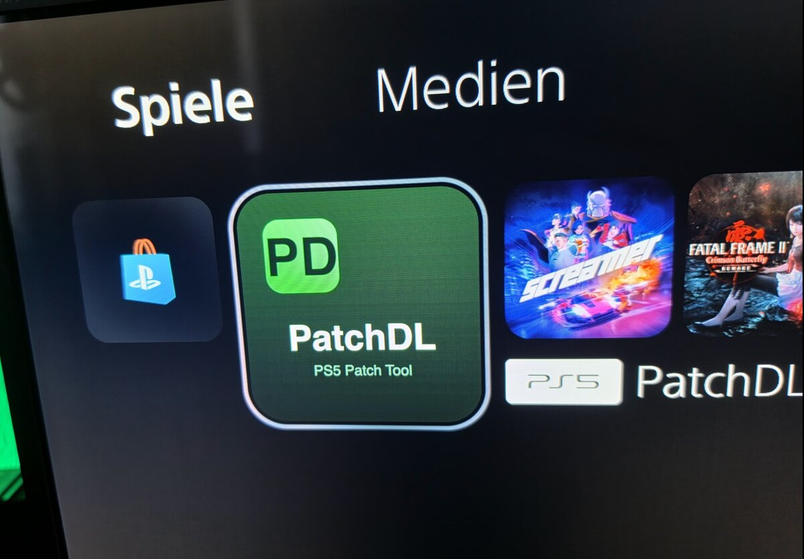
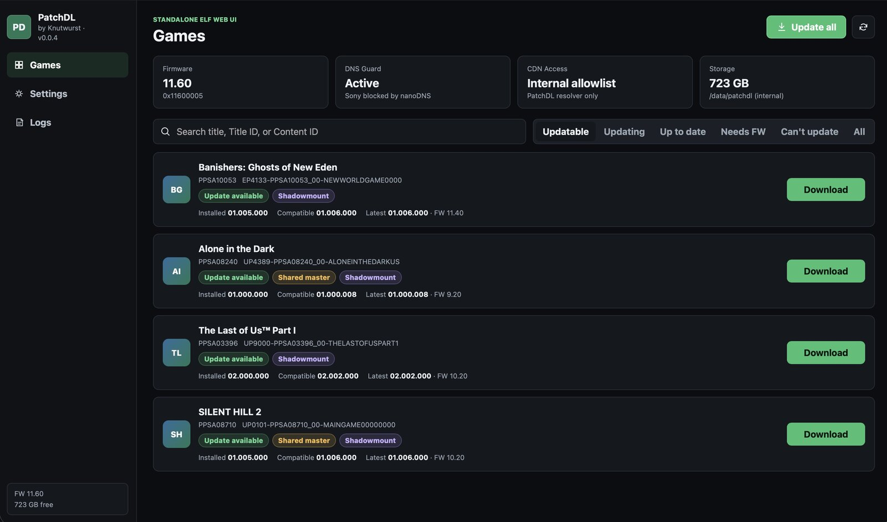
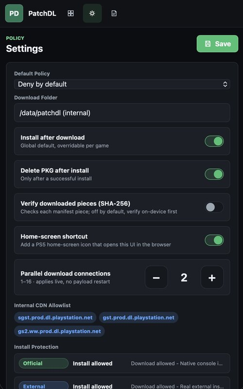
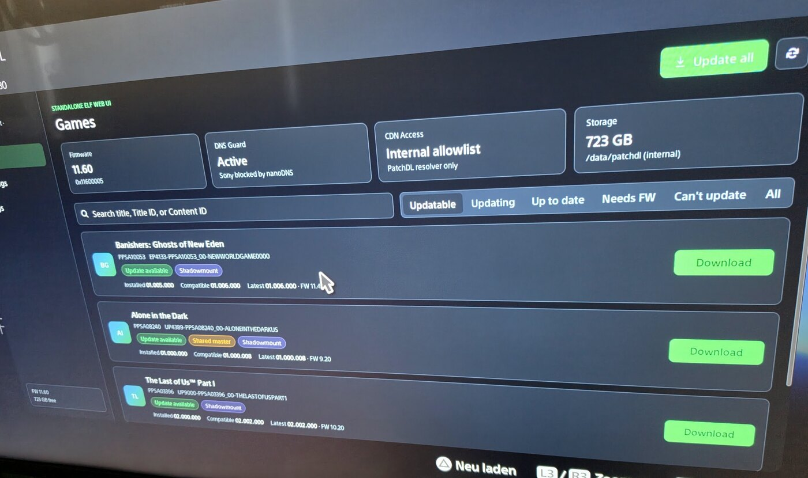
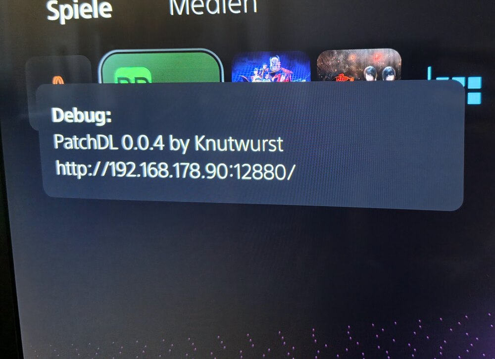

# PatchDL

A self-contained patch downloader and installer for the PS5, with its own
dark-mode web UI. Drop it on the console, open the URL on any device on the
same network, pick the games you want patched.

<p align="center">
  
</p>

## What it does

- Lists every game installed on your console and looks up the newest update
  Sony has published for it.
- Compares the available patch against your firmware and only offers updates
  that will actually run on the system you have.
- Downloads the update package into internal storage and installs it
  on-console — same end result as a normal system update, with you in control
  of when and what.
- Pauses, resumes, and survives reboots: a 60 GB patch can be picked up where
  it left off after a power-cycle.

## The web UI

Open `http://<console-ip>:12880/` in any browser on the network. The UI works
full-screen in the on-console browser, in any desktop browser, and on phone.

<p align="center">
  
</p>

The Games view groups everything you have installed into filter chips:

- **Updatable** is selected by default — games with an installable update.
- **Updating** is the queue: jobs waiting for a free slot.
- **Up to date**, **Needs FW**, **Can't update** — the rest.
- **All** is the flat list, top-right corner.

**Update all** in the top bar queues everything that's installable in one
click. A live banner above the games list shows the current title, its
download speed, ETA, and a `3 of 9`-style position when more than one
update is running through the queue.

## Settings

<p align="center">
  
</p>

Settings persist across restarts and apply live — nothing needs a reboot.

- **Default policy** to allow or deny new titles by default, with a per-game
  override.
- **Install after download** so a finished update applies itself.
- **Delete the package after install** to reclaim the disk space.
- **Verify downloaded pieces** with a checksum while transferring.
- **Home-screen shortcut** that drops a PatchDL tile on the PS5 home menu;
  tapping the tile opens the web UI in the on-console browser.
- **Parallel download connections** (1–16), tunable on the fly.

## Home-screen tile

Toggle the shortcut on and PatchDL registers itself as a regular app on the
PS5 home screen. Tap the tile and the on-console browser opens straight on the
games list.

<p align="center">
  
</p>

## Build

```sh
scripts/build_ps5.sh        # produces patchdl-ps5.elf
```

Needs the `ps5-payload-dev` SDK and the prebuilt `libcurl` + `OpenSSL` from its
`pacbrew-repo`. `libmicrohttpd` is vendored, SQLite too.

## Deploy

`scripts/deploy_ps5.sh` uploads the build, replaces any running instance, and
launches the new one. On launch you get an on-screen notification with the
exact URL to open.

```sh
PS5_HOST=<console-ip> scripts/deploy_ps5.sh
```

<p align="center">
  
</p>

## License

by Knutwurst
