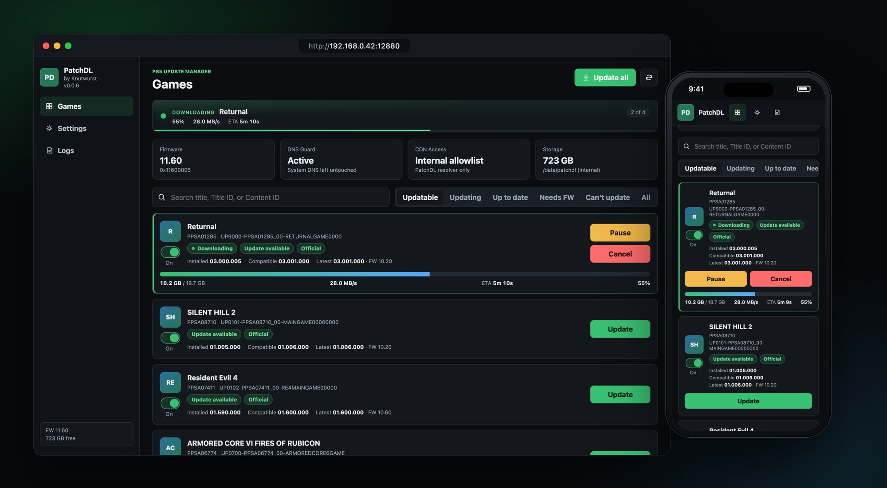
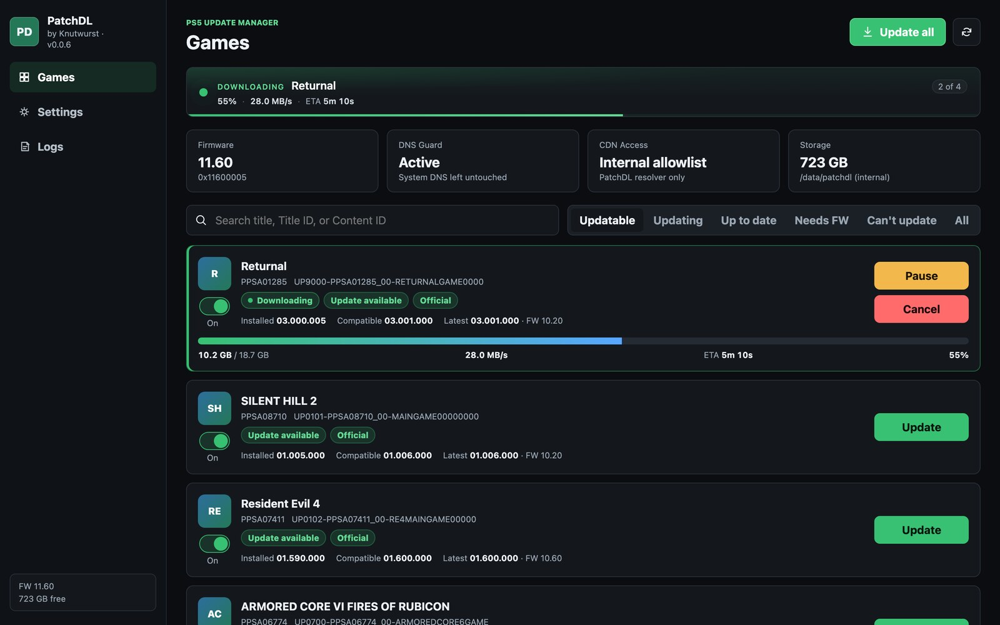
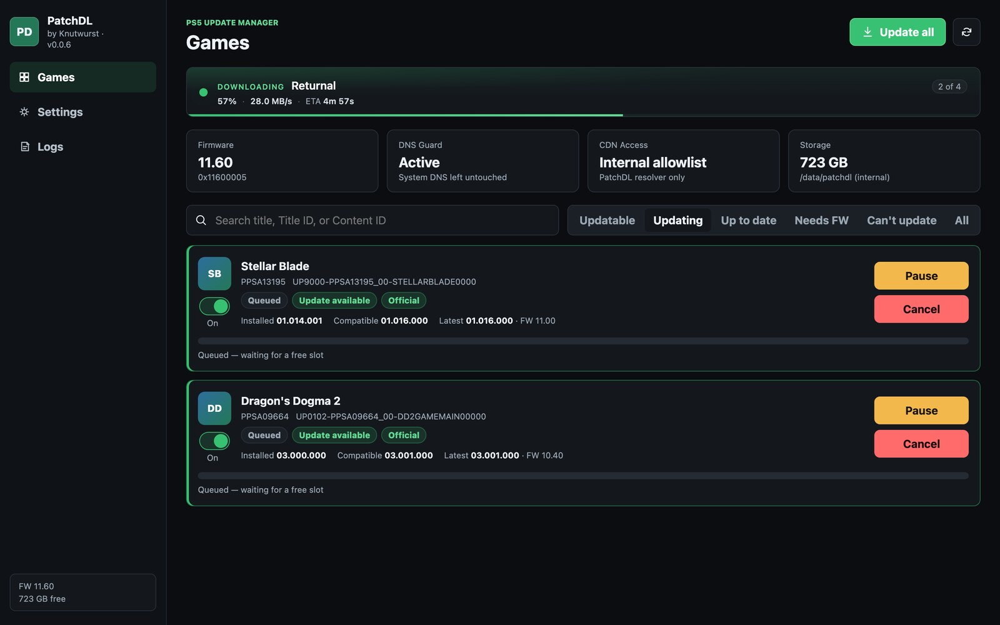
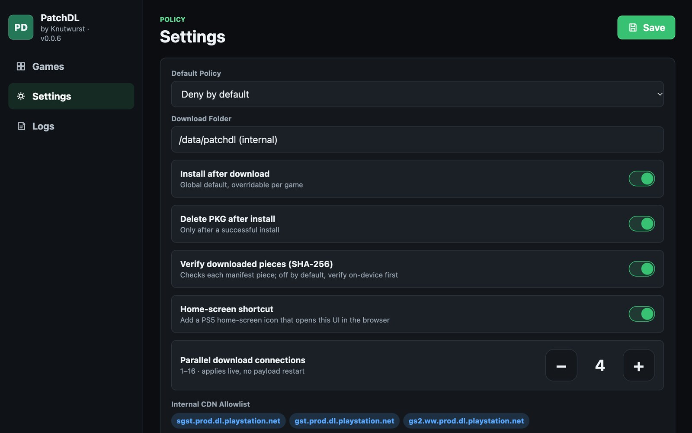
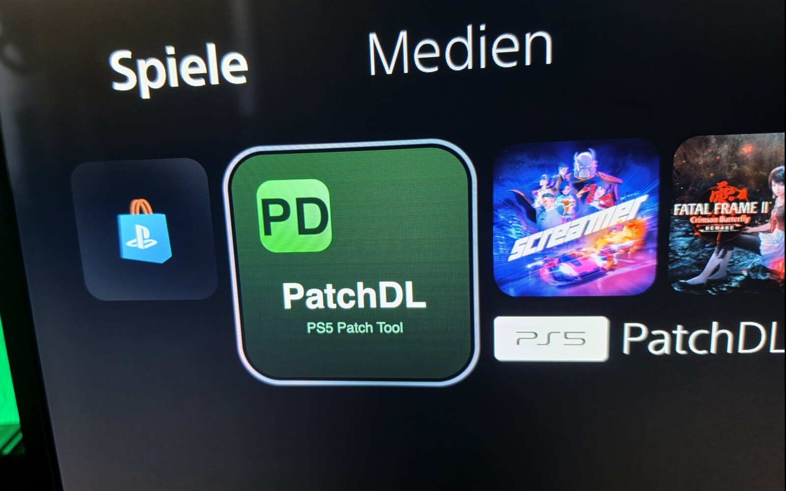
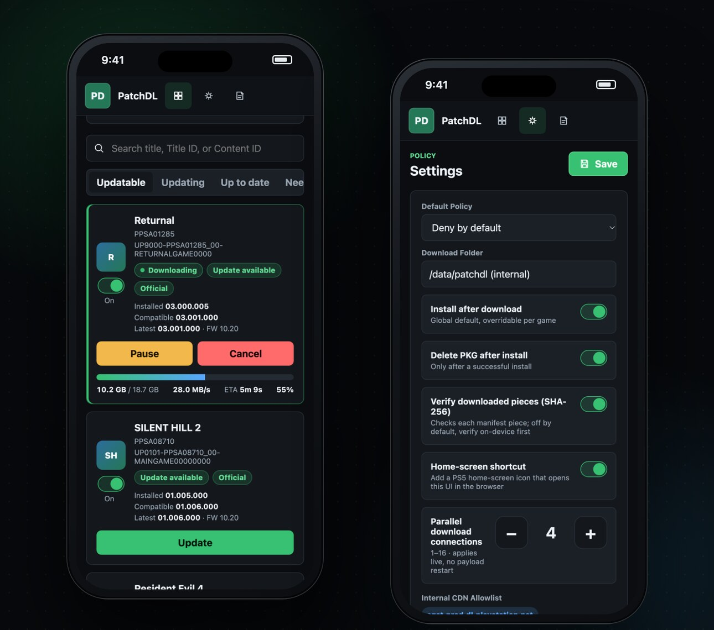

<h1 align="center">PatchDL</h1>

<p align="center">
  
</p>

<p align="center">
  <b>Official game updates for your PS5, from any browser.</b><br>
  PatchDL finds the newest update for every game on your console, downloads it at full speed and installs it.<br>
  Run it from your phone, your laptop or the PS5 itself.
</p>

<p align="center">
  
  
  
  
  
</p>

<p align="center">
  <a href="https://github.com/knutwurst/patchdl/releases/latest">
    
  </a>
</p>

---

## Highlights

- **Your whole library at a glance.** Every installed game shows up with its version and the newest update Sony offers for it.
- **Update all.** One click queues every game that has an update. PatchDL works through the queue and installs each update as soon as it lands.
- **Fast downloads.** Up to 16 parallel connections per update. Change the number in Settings while a download runs.
- **Survives reboots.** Pause, resume, or lose power: PatchDL saves progress after every finished piece and continues where it stopped.
- **Made for your firmware.** You only see updates your console can run, so no game ends up asking for newer system software.
- **Checked against Sony's checksums.** Turn on verification and PatchDL compares every piece with the SHA-256 Sony publishes for it.
- **A tile on your home screen.** One toggle adds PatchDL to the PS5 home screen. Tap it and the UI opens in the console's browser.
- **Live progress.** A banner at the top shows the current game, speed, time left and where you are in the queue.

## Screenshots

<table>
  <tr>
    <td align="center" width="50%"><br><sub><b>Games</b> &nbsp;·&nbsp; every game, its version and the update waiting for it</sub></td>
    <td align="center" width="50%"><br><sub><b>Updating</b> &nbsp;·&nbsp; the queue, next to the download that's running</sub></td>
  </tr>
  <tr>
    <td align="center" width="50%"><br><sub><b>Settings</b> &nbsp;·&nbsp; changes apply right away, no restart</sub></td>
    <td align="center" width="50%"><br><sub><b>Home screen</b> &nbsp;·&nbsp; the PatchDL tile on a real PS5</sub></td>
  </tr>
</table>

## Fits any screen

Start an update from the couch with your phone, check on it from your laptop, or open it on the TV. The UI adapts to whatever screen it's on.

<p align="center">
  
</p>

## Get started

1. Download `patchdl_<version>.elf` from the [latest release](https://github.com/knutwurst/patchdl/releases/latest).
2. Send it to your PS5 with the ELF loader you already use.
3. A notification on the TV shows the address, for example `http://192.168.0.42:12880/`. Open it in any browser on your network.
4. Optional: switch on **Home-screen shortcut** in Settings to get the PatchDL tile.

**You need** a PS5 that can load ELF payloads. PatchDL is tested on firmware 11.60.

## Good to know

**Does PatchDL download games?**
No. It fetches updates for games that are already installed on your console. Nothing else.

**Where do the updates come from?**
From Sony's official update servers, the same files your console downloads on its own. PatchDL only talks to a short list of PlayStation CDN hosts.

**Does it change the updates?**
No. Each package stays exactly as Sony published it, and the console's own installer applies it.

**Will it touch my system software?**
No. PatchDL never downloads system software, and it only offers game updates that run on the firmware you have.

**What about disc games?**
Put the disc in, same as with any update.

**What happens if the power goes out?**
Start PatchDL again and press Resume. Finished pieces stay on disk.

## Disclaimer

PatchDL is an independent project. It is not affiliated with, endorsed by or sponsored by Sony Interactive Entertainment. "PlayStation" and "PS5" are trademarks of Sony Interactive Entertainment Inc. and appear here only to name the console PatchDL works with.

PatchDL downloads official, unmodified game updates that Sony publishes for games already installed on your console. It does not download games, does not contain or distribute Sony software, keys or game content, and does not install unsigned or modified packages. Use it with games you own, and follow the laws of your country and the terms that apply to you. This project does not support piracy, and issues about pirated content will be closed.

<details>
<summary><b>Build from source</b></summary>

<br>

```sh
scripts/build_ps5.sh        # produces patchdl-ps5.elf
```

You need the [ps5-payload-dev SDK](https://github.com/ps5-payload-dev/sdk) with `libcurl` and `OpenSSL` from its [pacbrew-repo](https://github.com/ps5-payload-dev/pacbrew-repo). `libmicrohttpd` and SQLite are vendored. GitHub Actions builds every push; tagged builds become releases.

To try a build on your own console:

```sh
PS5_HOST=<console-ip> scripts/deploy_ps5.sh
```

</details>

## Credits

PatchDL is written in C and builds on [libmicrohttpd](https://www.gnu.org/software/libmicrohttpd/), [libcurl](https://curl.se/), [OpenSSL](https://www.openssl.org/), [SQLite](https://sqlite.org/) and the [ps5-payload-dev SDK](https://github.com/ps5-payload-dev/sdk). Thanks to everyone behind them.

## License

PatchDL is free software under the **GNU General Public License v3.0 or later**. See [LICENSE](LICENSE). Use it, study it, change it, share it. Forks stay under the same license.

Copyright © 2026 Knutwurst.
